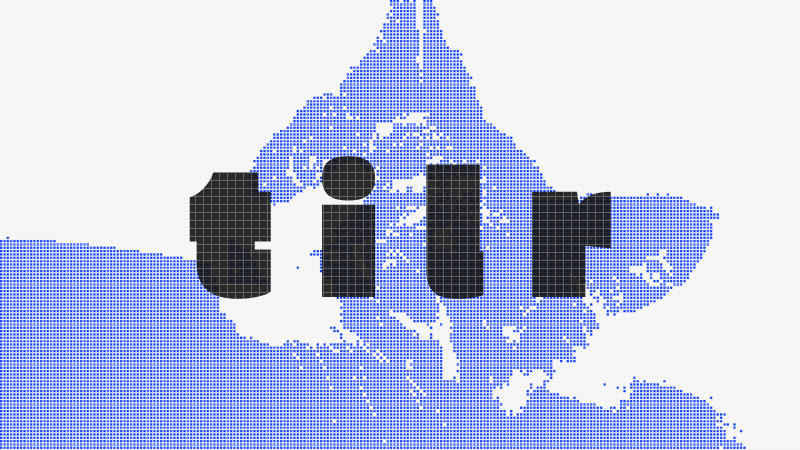
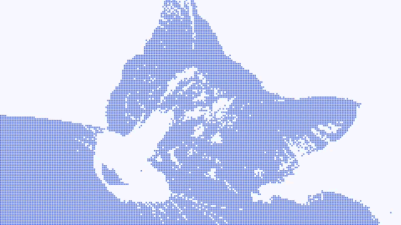

<h1 align="center">
  tilr - Tile Animation Generator
</h1>

<p align="center">
  
</p>

<p align="center">
  
  
  
  
</p>

<p align="center">
  <b>English</b> |
  <a href="./README.ja.md">日本語</a>
</p>

---

## Table of Contents

- [About](#about)
- [Technologies](#technologies)
- [Prerequisites](#prerequisites)
- [Installation](#installation)
- [Usage](#usage)
  - [CLI](#cli)
  - [Programmatic API](#programmatic-api)
  - [Decoder](#decoder)
- [Output Format](#output-format)
- [Pipeline](#pipeline)
- [Viewer](#viewer)
- [Documentation](#documentation)
- [Contributing](#contributing)
- [License](#license)

---

## About

| original                   | tile animation                        |
| -------------------------- | ------------------------------------- |
|  |  |

Tile Animation Generator transforms ordinary videos into charming, pixel-art style tile animations. Extract silhouettes from any video and watch them come alive as playful, retro-inspired mosaic animations in your web browser.

Perfect for creating unique visual effects, artistic presentations, or adding a nostalgic pixel aesthetic to your projects.

**Bonus**: The efficient CADF binary format achieves 94.8% size reduction, making animations lightweight and fast to load.

---

## Technologies

| Technology | Version | Description            |
| ---------- | ------- | ---------------------- |
| Node.js    | >= 18   | Runtime environment    |
| ffmpeg     | Latest  | Video frame extraction |
| Jimp       | ^1.6.0  | Image processing       |
| Commander  | ^13.1.0 | CLI framework          |

---

## Prerequisites

- **Node.js 18** or higher
- **ffmpeg** installed on your system

### Supported Video Formats

This tool supports all video formats that ffmpeg can decode:

| Format | Extension       |
| ------ | --------------- |
| MP4    | `.mp4`          |
| WebM   | `.webm`         |
| AVI    | `.avi`          |
| MOV    | `.mov`          |
| MKV    | `.mkv`          |
| FLV    | `.flv`          |
| WMV    | `.wmv`          |
| MPEG   | `.mpeg`, `.mpg` |

> **Note**: Any format supported by your installed ffmpeg version will work.

### Installing ffmpeg

```bash
# Ubuntu/Debian
sudo apt-get install ffmpeg

# macOS
brew install ffmpeg

# Windows
# Download from https://ffmpeg.org/download.html
```

---

## Installation

```bash
npm install tilr
```

Or clone the repository:

```bash
git clone https://github.com/sahksas/tilr.git
cd tilr
npm install
```

---

## Usage

### CLI

**Basic usage:**

```bash
npx tilr video.mp4 -o ./output
```

**With options:**

```bash
npx tilr video.mp4 -o ./output \
  --fps 15 \
  --tile-size 8 \
  --chunk-size 60 \
  --verbose
```

**Show help:**

```bash
npx tilr --help
```

#### CLI Options

| Option                      | Default          | Description                  |
| --------------------------- | ---------------- | ---------------------------- |
| `-o, --output <dir>`        | `./<video-name>` | Output directory             |
| `--fps <number>`            | `15`             | Frame rate                   |
| `--tile-size <number>`      | `8`              | Tile size in pixels          |
| `--chunk-size <number>`     | `60`             | Frames per chunk             |
| `--brightness-min <number>` | `10`             | Minimum brightness threshold |
| `--brightness-max <number>` | `120`            | Maximum brightness threshold |
| `--green-ratio <number>`    | `1.5`            | Green color ratio threshold  |
| `-v, --verbose`             | `false`          | Enable verbose logging       |

### Programmatic API

```javascript
import { generateTileAnimation } from "tilr";

const result = await generateTileAnimation({
  inputVideo: "./video.mp4",
  outputDir: "./output",
  fps: 15,
  tileSize: 8,
  chunkSize: 60,
});

console.log(`Generated ${result.totalChunks} chunks`);
console.log(`Size reduction: ${result.stats.reduction}%`);
```

### Decoder

The decoder works in both Node.js and browser environments:

```javascript
import { decodeCADF } from "tilr/decoder";

// Node.js
import fs from "fs";
const buffer = fs.readFileSync("./output/frames-001.bin");
const frames = decodeCADF(buffer);

// Browser
const response = await fetch("./frames-001.bin");
const arrayBuffer = await response.arrayBuffer();
const frames = decodeCADF(arrayBuffer);

// Result: frames[0] = { frame: 0, coordinates: [[x, y], ...], totalPoints: 14250 }
```

---

## Output Format

### Directory Structure

```
output/
├── frames-001.bin   # CADF binary chunk 1
├── frames-002.bin   # CADF binary chunk 2
├── ...
└── config.json      # Metadata
```

### Binary Format (CADF)

CADF (CAT Diff Format) uses differential encoding for maximum efficiency:

- **First frame**: Complete coordinate data
- **Subsequent frames**: Only differences from the previous frame

| Metric                  | Value |
| ----------------------- | ----- |
| JSON → CADF reduction   | 94.8% |
| With Brotli compression | 98.3% |

---

## Pipeline

The generation process consists of 4 steps:

1. **Frame Extraction** - Extract frames from video using ffmpeg
2. **Silhouette Extraction** - Detect tile coordinates using Jimp
3. **Chunk Splitting** - Split data into manageable chunks
4. **Binary Conversion** - Encode to CADF with round-trip verification

---

## Viewer

Preview generated animations using the built-in viewer:

```bash
# Using the CLI
npx tilr view ./output

# Or manually with http-server
npx http-server ./output -p 8080
# Open http://localhost:8080/viewer/ in your browser
```

**Viewer Features:**

- Play/pause animation
- Seek through frames
- Adjust tile size, color, and background

---

## Documentation

- [Binary Format Specification](./docs/binary-format.md) - Detailed CADF format documentation
- [Generation Pipeline](./docs/pipeline.md) - Pipeline architecture and configuration

---

## Contributing

Contributions are welcome! Please follow these steps:

1. Fork the repository
2. Create a feature branch (`git checkout -b feature/amazing-feature`)
3. Commit your changes (`git commit -m 'Add amazing feature'`)
4. Push to the branch (`git push origin feature/amazing-feature`)
5. Open a Pull Request

---

## License

This project is licensed under the MIT License - see the [LICENSE](LICENSE) file for details.
